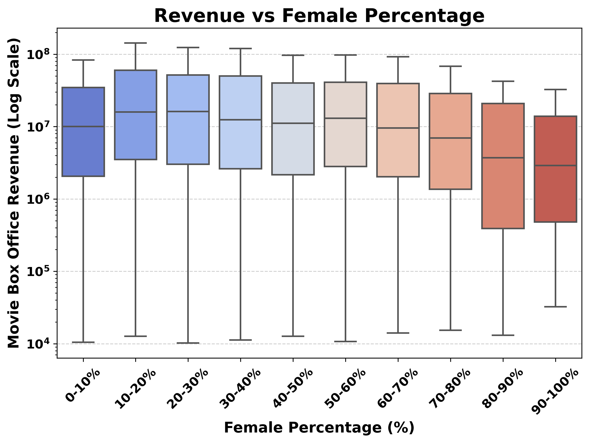
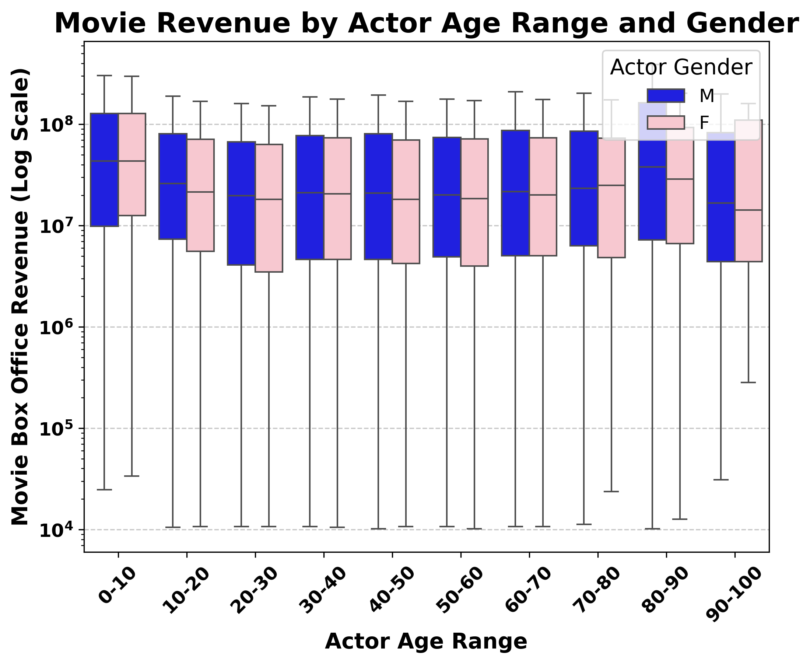

# Feminism, Representation, and Social Transformation in Film

Warning message. Louise is a fictitious character created for the sake of the project.

### Introduction

<figure id="sta">
    
    <figcaption style="text-align: center; margin-top: 4px;">
        Dall-e generated picture of Louise
    </figcaption>
</figure>
My name is Louise, I am 21 years old and I just finished a school of theater in Paris. Theater has always been my passion, but the problem is the very low and unreliable salary. My dream now is to work in the movie industry where I will be able to continue acting, while earning a sufficient income.  
A friend of mine told me: “Movies are made by men for men. Women are just here to add sexyness”. 

It struck me, as I never could imagine such a strong statement could be true. In this era of fake news, I could not let my dreams be ruined by a few words so I decided to take the matter in my own hands. I decided to pursue a class at EPFL called ADA, and do my own analysis of all the movie industry. Then, and only then, will I be able to determine whether my friend was right or not.

### Starting from the beginning

I went on the internet and downloaded the information of all movies from wikipedia. At first glance I wanted to see the ratio of actresses and actors. I found out that there are 2 times more actors than actresses. I was a little disoriented. But since I am in Paris, I checked the ratio, which is 1.71, slightly better than the average... I also took the opportunity to look at various countries, and whether they can beat France. Figure (<a href="#Female_actors_ratio">Figure 1</a>) shows the proportion of actresses in the world countries with at least 20 movies produced.

    <figure id="Female_actors_ratio" style="margin-right: 20px; text-align: left; width: 800px; height: 500px; margin-top: -40px; margin-bottom: 20px;">
        <iframe src="figs/Female_actors_ratio.html" style="width: 100%; height: 500px; border: none; object-fit: contain;" frameborder="0" scrolling="no"></iframe>
    </figure>

I was disappointed to see that women are much less present than men. I was especially disappointed by these proportions in countries carrying the twentieth-century movie legacy, like the USA and Russia, with slightly better scores in countries around France. But I did not lose hope, and figured that perhaps there was a great evolution of women in films. So I looked at the evolution of the percentage of women in films (<a href="#actress_num_movie">Figure 2</a>) globally.

    <figure id="actress_num_movie" style="margin-right: 20px; text-align: left;">
        <iframe src="figs/Mean_Ratio_and_Count_by_Movie_Release_Date.html" width="800" height="600" frameborder="0" scrolling="no"></iframe>
        <figcaption style="text-align: center; margin-top: 4px;">
            Ratio of actresses and number of movies by year
        </figcaption>
    </figure>

The proportion of women in films increases very slightly from the 60s. In 1960 there were 31% actresses in films, while in 2011 there are 35%. In France, the ratio of actresses is constant, but slithly higher than the global average.

One thing I learned from ADA is that valuable information can be hidden in the data so I decided to dig further and look at the evolution of actresses in film by movie genre. <a href="#inclusive_genre">Figure 3</a> shows the list of genre with the highest and lowest gender ratio.

    <figure id="inclusive_genre" style="margin-right: 20px; text-align: center; flex: 1 1 auto;">
        <iframe src="figs/top_genres.html" width="800" height="600" frameborder="0" scrolling="no"></iframe>
        <figcaption style="text-align: center; margin-top: 4px;">
            Most and least inclusive genres.
        </figcaption>
    </figure>

I find it amusing that the most "inclusive" genres after feminism films (all bellow 50% of actresses in the cast) happens to be 'softcore porn', 'sexploitation', or even 'kitchen sink realism'. The other genres are not much better: "Erotica drama", or "Pornographic movie". In case I want to become a pornstar, I know where to go 🫠 pfff. I will definitly need to see how women are represented in the film industry (will do later). On the other hand, the least inclusive genres are all those including violence or war. Woman are more tender that is true. 

Definitely, my future does not look very bright from this perspective. But with my theater background, I am sure I will be able to get good acting roles, and be as famous as Scarlett Johansson. Actually I am wondering how top actresses are represented ? Do they have actual big roles, and play in many big movies ? How long are they ‘stars’ ? Do they continue to be celebrities once they are older ?

And so I went and explored my data. The problem was that I didn’t have a way to identify the main actors from my dataset. Nothing stops me, so I went online, found out that IMDB had a list of main roles, downloaded all the data, cleaned it, merged it, until I had a nice dataframe, one that would satisfy Maria and Bob.

I directly looked at the distribution of main roles. I found out that men have 72% of first roles. But actually I saw before that there are much more actors than actresses. So in that sense, it is logical that there are more first role for actors. However, proportionally, I see that men still have 56% of the first roles. That means if there was the same number of actors and actresses, actors would be more likely to get the first role. Crazy. Similarly to before, perhaps there is a bit of hope in the evolution. <a href="#ev_gender_ratio_roles">Figure 4</a> shows the evolution of women having 1st, 2nd and 3rd roles. Nothing too glamorous as it remains quite constant. We can almost perceive a decrease in the share of women having first role :(. In 2012, there are only 26% of women with first role. That is not soo good for my carrer.

<figure id="ev_gender_ratio_roles" style="margin: 0; padding: 0; overflow: hidden;">
    <iframe 
        src="figs/percentage_evolution_of_actresses.html" 
        width="100%" 
        height="500" 
        style="border: none; display: block; overflow: hidden;" 
        scrolling="no">
    </iframe>
    <figcaption style="text-align: center; margin-top: 4px;">
        Evolution of the gender ratio for different roles 
    </figcaption>
</figure>

Let me investigate which genre is most welcoming for my career as an all time star. <a href="#genre_inslusive_firstrole">Figure 5</a> shows the most and least inclusive genre for first roles actors/actresses.

<figure id="genre_inslusive_firstrole" style="margin: 0; padding: 0; overflow: hidden; width: 750px; height: 500px;">
    <iframe 
        src="figs/first_role_genre.html" 
        width="100%" 
        height="400" 
        style="border: none; display: block; overflow: hidden;" 
        scrolling="no">
    </iframe>
    <figcaption style="text-align: center; margin-top: 4px;">
        Most and least inclusive genre for first role
    </figcaption>
</figure>

So either I am a feminist, or a pornstar. That's not very nice...

So clearly, women are not present in war films. But they are present in erotic movies 🙄

But if I become a star, how long will I remain a star? (Louise dreaming) 
If I start to get older, will I remain famous and loved by all my fans? So I looked at the average age for the starting and ending career for both actors and actresses (<a href="#av_age_actors">figure 6</a>)

<figure id="av_age_actors">
    <iframe src="figs/average_age_of_actors.html" width="1000" height="500" frameborder="0" scrolling="no"></iframe>
    <figcaption style="text-align: center; margin-top: 4px;">
        Begining and ending career age for actors and actressses
    </figcaption>
</figure>

So basically, actresses start their career, on average, at 27 while men start at 32 years old. I think that means actresses are only good if they are still young and pretty. I can also see a disparity when the actors/actresses retire. Men finish their career much older than women and also stay longer (10 year for men while only 8 years for women). 

But then I thought, perhaps famous actresses play longer… Let me check. <a href="#first_age">Figure 7</a> shows the age distribution for first role actors/actresses. 

<figure id="first_age">
    <iframe src="figs/images/age_distribution_first_role.png" width="700" height="700" frameborder="0" scrolling="no"></iframe>
    <figcaption style="text-align: center; margin-top: 4px;">
        Begining and ending career age for first role actors and actressses
    </figcaption>
</figure>
We see that first role actors play longer. Indeed, if we look at age 50, there are almost no actresses with first role, while men still have these roles. The most recurring age for first role actresses is 26 while it is 36 for men. That is not incredible for my career. I got to start soon. 

But then I thought perhaps women have shorter career, but are more highly remunerated. 

Since I planned on becoming the best of the best, I want to see how top actresses might be compensated with respect to actors, and how it has been changing over time. That’s why for each relevant country (where industries are big enough for me!) I plotted the share of revenues of movies where woman took the main role changing over time. 

    <figure id="Proportion_of_revenues_with_animation" style="margin-right: 20px; text-align: left; width: 800px; height: 550px;  margin-top: -40px; margin-bottom: 20px;">
        <iframe src="figs/Proportion_of_revenues_with_animation.html" style="width: 100%; height: 500px; border: none; object-fit: contain;" frameborder="0" scrolling="no"></iframe>
    </figure>

Maybe I should move out to some Scandinavian country, their seem to have plenty of revenue-generating productions, and the first roles are mostly taken by women!
However, I need to have "Plan B" in case I'm not the first actress... Is there any relation between the general gender ratio of a film and the revenue generated?

<figure id="sta">
    
    <figcaption style="text-align: center; margin-top: 4px;">
        Boxplot graph of revenue versus gender ratio for films 
    </figcaption>
</figure>

Oh wow actually it seems that movies with more men tend to generate more revenue, of course...🙄 There is a linear dropoff in revenue from female proportions above 60%. After running some hypothesis tests we see get a pearson coefficient of -0.072 with p value 4e-10 and a spearman coefficient of -0.067 with p value 8x10e-9. So the correlation is not very strong, but it is statistically significant.

And is there a correlation between an actress's age and the revenue of the movie in which she plays?

<figure id="sta">
    
    <figcaption style="text-align: center; margin-top: 4px;">
        Boxplot graph of movie revenue versus age for films 
    </figcaption>
</figure>

Okay there's no strong correlation, except that movies with very young or very old actors tend to make very slightly more money.

So until now I figured that actresses play in smaller budget films, are younger than actors, are much much fewer than actors, and that there are no promising trend. Now I wonder whether we can see how women are portrayed in the film industry. 

## How are women represented ?

Now let’s see the types of roles I could have as an actress. How will people describe my roles? What type of actions will my characters perform? To find this out I need to have a way to differentiate female characters from men characters in movies. Let me look at the distribution of proportions of female characters in movies.

<figure id="sta">
    
    <figcaption style="text-align: center; margin-top: 4px;">
        Percentage of females in movie cast across all movies in CMU Dataset
    </figcaption>
</figure>

Well, it is highly skewed right, but that’s no real surprise anymore based on my previous analyses… Oh, this gives me an idea! I’ll split films by character gender ratio and look at the descriptive adjectives and verbs used in films with more men than women and vice versa through NLP methods. A ratio of 1:2 seems like a good cutoff point. I’ll also remove words that show up for both male dominant and female dominant films at similar frequencies.

    <figure id="fa" style="text-align: center;">
        
        <figcaption style="margin-top: 8px;">Most Common adjective lemmas for movies with more than two thirds female characters</figcaption>
    </figure>
    <figure id="ma" style="text-align: center;">
        
        <figcaption style="margin-top: 8px;">Most Common adjective lemmas for movies with more than two thirds male characters</figcaption>
    </figure>

    <figure id="fv" style="text-align: center;">
        
        <figcaption style="margin-top: 8px;">Most Common verb lemmas for movies with more than two thirds female characters</figcaption>
    </figure>
    <figure id="mv" style="text-align: center;">
        
        <figcaption style="margin-top: 8px;">Most Common verb lemmas for movies with more than two thirds male characters</figcaption>
    </figure>

Ah, well that’s not super encouraging either… It seems films with mostly women characters are characterized by love, marriage, pregnancy and sexuality… While movies with mostly men revolve around violence, power struggles, and crime. Ok let’s try a different approach to see the topics of movies with a large proportion of actresses.

Ok we see similar trends as the word cloud, but for the most part the variations are not as drastic as they could be. Running some hypothesis tests, all the variations are statistically significant.

# Exploring the Language of Film Through Gendered Lenses

## Introduction

I’ve spent quite some time looking at the proportion of actresses and actors in films, the roles they take, and how those numbers vary by time and place. I’ve seen that women are underrepresented, even though the situation has slightly improved over time. But raw numbers aren’t the whole story. If I really want to understand whether films reflect a masculine or feminine perspective, I need to look deeper. Are movies made “by men for men,” as my friend suggested, or do the stories themselves evolve when more women are involved?

To go further, I’ve decided to analyze the *language* used to summarize these films. Specifically, I want to know if movies with a higher proportion of actresses differ thematically from those dominated by actors. If they do, how do these themes vary over time and across regions? And are these differences actually statistically significant, or could they be due to chance?

## Preparing the Textual Data

To ensure I was comparing films on an even footing, I began with a thorough preprocessing of the movie summaries:

-   **Lowercasing:** All text was converted to lowercase.
-   **Lemmatization:** Words were reduced to their dictionary form (e.g., “running” → “run”).
-   **Filtering Common/Rare Terms:** Extremely common and extremely rare words were removed to focus on words that carry meaningful distinctions.
-   **Enghlish language:** only words in English were kept
-   **Person:** All name of persons were removed as they don't add meaning to the theme analysis

This cleaned corpus set the stage for identifying thematic categories.

### Defining and Identifying Thematic Categories

I have developed a series of thematic categories that capture key concepts such as "love," "violence," "family," "career," and "empowerment." The process began with creating a seed list of words that encapsulate the essence of each category. Utilizing the language model (all-MiniLM-L6-v2), I transformed these seed words into vectors within a semantic space and calculated a "centroid" for each category. This centroid serves as a semantic average, representing the core of each concept.

### Quantifying Thematic Presence in Movie Summaries

To measure the prevalence of each thematic category within movie summaries, I considered a method that counts the occurrences of words associated with each category. To define these category-specific words, I utilized the centroids as reference points and identified words similar to them by calculating cosine similarity between their vectors. This process involved selecting the most similar words from a pool of unique words found across all summaries. For each category, I selected the top *n* closest words to its centroid. The presence of these words in a summary is then quantified, forming a score based on their relative frequency compared to the total word count.

This score gives us an idea of the sentiment of the movie summaries, but to distinguish it from the sentiment analysis and given the fact that it is based on semantic similarities it will be called semantic score.

### Visualizing Category Word Clusters

To validate the coherence of the defined categories, I analyzed which words were most closely related to the centroids of each category. By selecting the top 100 words for each category, I expanded each theme beyond its initial seed list. To visually represent these relationships, I created a 3D plot where each point signifies a word, with proximity indicating semantic similarity. This visualization helps confirm that the categories are logically structured, with clustered words sharing related meanings.

**Figure: 3D Visualization of Category Clusters**\

<figure id="fig6">

<iframe src="figs/centroids_top_words_plot_3d.html" width="1000" height="500" frameborder="0" scrolling="no">

</iframe>

<figcaption style="text-align: center; margin-top: 4px;">

Evolution of the gender ratio for different roles

</figcaption>

</figure>

**Description:**\
In this plot, each cluster corresponds to one thematic category. For example, “love” words might cluster in one region, while “violence” words form a distinct cluster elsewhere. Tight clustering suggests that the categories are capturing coherent themes. We can also see how some themes are intertwined between each other, like aggression and violence.

## Scoring Films by Thematic Content

Now that the methods have been defined I've calculated the semantic score of each category for every movie summary in the dataset. I want to compare how these themes varies depending on how many women are present in the movies

## Relationship Between Gender Proportion and Category Intensity

Continuing my exploration into how gender dynamics influence film narratives, I've focused on five thematic categories: Family, Relationships, Love, Violence, and Happiness. These were selected due to their variability and relevance in understanding narrative shifts as female representation changes.

**Figure 4: Regression of Female Proportion vs. Category Score**

<figure id="fig7">

<figcaption style="text-align: center; margin-top: 4px;">

Semantic score vs Female percentage

</figcaption>

</figure>

**Visualizing Trends**: Using regression analysis, I plotted these categories against the percentage of female actors. This visual approach reveals distinct trends:

-   **Family, Relationships, and Love** show a clear upward trend with more female actors, suggesting these themes are emphasized more in films with greater female involvement.

-   **Violence** trends downwards, indicating less focus on violent themes as female representation increases.

-   **Happiness** shows a slight increase, suggesting its portrayal may not be influenced by gender dynamics.ù

## Splitting the Dataset by Gender Dominance

From the previous graph we could already see that the scores can change depending on the percentage of female actress in the movies. Let's now try to split the dataset to see if we can see this difference also for other sentiments:

Since my focus is on gender representation and perspective, I split the dataset into two groups:

-   **Female-Dominant Films:** Movies with a higher proportion of actresses (more than 2/3).
-   **Male-Dominant Films:** Movies with a higher proportion of actors (more than 2/3).

Comparing category scores across these two subsets could reveal whether different gender balances correlate with shifts in narrative themes.

## Comparing Thematic Scores Between Female- and Male-Dominant Films

I aggregated the category scores for both subsets and visualized them side-by-side.

**Figure 2: Average Category Scores by Gender Dominance**

<figure id="fig2">

<iframe src="figs/interactive_sentiment_comparison.html" width="1000" height="600" frameborder="0" scrolling="no">

</iframe>

<figcaption style="text-align: center; margin-top: 4px;">

Average category scores by gender dominance

</figcaption>

</figure>

**Description:**\
This figure shows, for each thematic category, the average score among female-dominant and male-dominant films. Bars are accompanied by error bars indicating the 95% confidence interval.

### Observations from the Sentiment Analysis

#### Higher Scores in Female-Dominated Films:

-   **Family and Relationships**: Categories that typically emphasize interpersonal connections and familial bonds show significantly higher scores in films with at least 66% female presence. This suggests a thematic focus on exploring complex interpersonal dynamics in female-dominated films.
-   **Empowerment and Social Issues**: These themes also record higher sentiment scores in films with more female actors, possibly reflecting a narrative emphasis on empowerment and societal challenges.

#### Similar Scores Across Different Gender Proportions:

-   **Happiness and Sadness**: The sentiment scores for happiness and sadness are relatively consistent, regardless of gender proportion. This indicates a uniform approach to portraying these emotions across films with varying gender distributions.

#### Higher Scores in Male-Dominated Films:

-   **Aggression and Violence**: Notably higher in films with less than 33% female presence, indicating a possible trend where male-dominated films might focus more on themes of conflict and physical confrontation.
-   **Adventure and Technology**: These categories also tend to score higher in films dominated by male actors, which may suggest a genre influence where traditionally male-targeted genres like sci-fi and action prioritize such elements.

**Statistical Note:**

It's clear how especially for some categories the difference between male- and female-dominant movies is drastic, but it's better to be sure.\
I conducted Mann-Whitney U tests for each category to assess whether the differences in medians are significant. Several categories—such as those related to “family,” “love,” or “relationships”—show significantly higher scores in female-dominant films, while categories related to “violence” or “aggression” are higher in male-dominant ones. These results reinforce the notion that more women on screen might correlate with more relational, less confrontational narratives.

| Category | Female Mean | Male Mean | p-value | Significant? | Higher in |
|----|----|----|----|----|----|
| Love | 0.021 | 0.011 | 1.51e-124 | Yes | Female Majority |
| Aggression | 0.006 | 0.008 | 8.43e-38 | Yes | Male Majority |
| Violence | 0.019 | 0.028 | 1.17e-123 | Yes | Male Majority |
| Family | 0.057 | 0.035 | 8.07e-176 | Yes | Female Majority |
| Happiness | 0.012 | 0.007 | 6.32e-40 | Yes | Female Majority |
| Sadness | 0.006 | 0.004 | 1.18e-15 | Yes | Female Majority |
| Fear | 0.005 | 0.005 | 7.29e-04 | Yes | Female Majority |
| Empowerment | 0.006 | 0.006 | 1.87e-35 | Yes | Male Majority |
| Relationships | 0.039 | 0.024 | 1.65e-151 | Yes | Female Majority |
| Career | 0.021 | 0.023 | 5.67e-18 | Yes | Male Majority |
| Social_issues | 0.006 | 0.007 | 3.04e-30 | Yes | Male Majority |
| Emotional_complexity | 0.010 | 0.008 | 5.61e-04 | Yes | Female Majority |
| Heroism | 0.005 | 0.006 | 6.86e-46 | Yes | Male Majority |
| Conflict_resolution | 0.014 | 0.018 | 2.37e-57 | Yes | Male Majority |
| Adventure | 0.013 | 0.013 | 1.50e-05 | Yes | Female Majority |
| Mystery | 0.014 | 0.019 | 1.43e-51 | Yes | Male Majority |
| Technology | 0.009 | 0.009 | 8.07e-09 | Yes | Female Majority |

## Temporal Dynamics of Thematic Differences

It’s also essential to consider how these differences evolve over time. Perhaps early in cinema history, all films were similar, but patterns emerged later.

**Figure 3: Temporal Trends in Category Scores by Gender Dominance**\

<figure id="fig2">

<iframe src="figs/sentiments_time.html" width="1000" height="600" frameborder="0" scrolling="no">

</iframe>

<figcaption style="text-align: center; margin-top: 4px;">

Average category scores by gender dominance

</figcaption>

</figure>

The evolving trends in cinema's thematic portrayals reveal nuanced shifts that might reflect broader societal changes and values. Notably, adventure themes show an intriguing divergence; they are increasingly depicted in films with more female presence, suggesting a break from traditional gender roles, whereas these themes are declining in male-dominated films. Fear is also rising in films with more female actors, maintaining relative stability in male-led narratives, which could indicate a growing exploration of vulnerability in female-driven stories.

Interestingly, the sentiment surrounding social issues is on a decline for both genders, perhaps reflecting a transient phase in the societal interest or cinematic focus on these topics. Technology, on the other hand, sees a sharp increase in both female and male-dominated films, mirroring the rising prominence of tech in everyday life and possibly indicating a universal appeal of sci-fi and technological advancements.

The portrayal of sadness and empowerment shows gendered trends, with sadness increasing significantly more in female-dominated films, perhaps pointing to a deeper emotional exploration. Empowerment, conversely, is increasing more noticeably in films led by males, which might suggest differing approaches to depicting strength and agency across gender lines. The sentiment scores for career themes remain stable in female-centric films but are climbing in those with male leads, possibly highlighting traditional views of career-oriented narratives as more aligned with male protagonists.

Overall, these trends suggest a slow but steady diversification of film content with increasing female involvement, moving towards richer emotional landscapes and greater social relevance, while male-dominated films continue to reinforce conventional action-oriented narratives. Well this is not promising...

## Geographic Variations

I'm not convinced yet, I want to dig deeper! What about the geographical distribution of these themes? Maybe it's not the same everywhere in the world.

To understand if cultural context matters, I mapped category differences worldwide. Do certain regions lean towards more traditionally “feminine” narratives when more women are involved?

This world map visualization shows each country colored or marked depending on which subset (female- or male-dominant) scores higher in a chosen category. Patterns might emerge, such as European countries showing a stronger “love” or “empowerment” theme when more women are present, while other regions remain more neutral.

**Figure 6: Geographic Distribution of Category Differences**\

<figure id="fig2">

<iframe src="figs/geographic_sentiment_score.html" width="1000" height="600" frameborder="0" scrolling="no">

</iframe>

<figcaption style="text-align: center; margin-top: 4px;">

Average category scores by gender dominance

</figcaption>

</figure>

Indeed, regional variations add another layer of complexity to the global cinematic landscape. Notably, love, traditionally perceived as more prevalent in female-dominated films, actually features more prominently in male-led films in North America. This regional exception challenges the general trend and suggests a cultural specificity in storytelling. Conversely, violence remains a universally male-dominated theme, confirming its global association with traditional male narratives.

Interestingly, aggression, which is typically higher in films with more male influence, shows a higher presence in female-dominated movies in specific countries like Spain, Germany, and Russia. This could indicate unique cultural narratives or film-making styles that empower female roles in unexpected ways. Family, paints the whole map pink, indicating its prevalence in female-led films, shows notable exceptions such as in Sweden, where it might not follow the typical pattern.

A part from this the trends seems to be in line with what said before.

## Observations

Working through this textual analysis, the trends reveal that the presence of more women in films often correlates with distinct thematic shifts, particularly in regions where cultural nuances influence narrative styles. While these shifts don’t completely dismantle long-standing stereotypes, they are real, statistically significant, and vary from region to region.

Despite the industry’s historical bias of being "made by men for men," the data shows encouraging signs of change. Films with higher female participation are increasingly exploring complex themes such as emotional depth, social issues, and empowerment, especially in settings where female-led narratives challenge conventional roles. These patterns, evolving over time and across different cultural landscapes, underscore a dynamic shift in how stories are told, reflecting broader societal changes.

I’ll carry these insights forward as I continue to explore the industry and shape my own journey within it.
# Giving a voice to women: looking at directors

I’ve focused all my energy on researching actors so far, but what if I looked at directors instead? Are women directors more inclusive? Do they also suffer inequalities? What if I ever want to direct a movie? What are my chances? 

I’ll first look at general gender ratio across directors and the average number of movies per director. Does that change across genders?.

<figure>
    <iframe src="figs/directors_html/director_gender_combined_plots_side_by_side" width="1100" height="500" frameborder="0" scrolling="no"></iframe>
    <figcaption style="text-align: center; margin-top: 4px;">Director / Gender distribution + Average number of movies per gender</figcaption>
</figure>

Ouch… Ok, I see that there is only 10 % of women directors in the dataset. I also see that they produce 2 times less movies than directors. Maybe in previous years the industry was more male dominated? How has this proportion evolved over the years?  

<figure>
    <iframe src="figs/directors_html/director_gender_by_year_bins.html" width="1100" height="600" frameborder="0" scrolling="no"></iframe>
    <figcaption style="text-align: center; margin-top: 4px;">Director Gender Representation by Year</figcaption>
</figure>

Looks like it increased a little bit compared to the 70s, but we are still a minority! The proportion of female directors is limited to 10% even in the most recent years. Maybe I should consider geographical location as well. Are there some countries with higher proportions of female directors? Should I really move countries?

<figure>
    <iframe src="figs/directors_html/director_countries.html" width="1100" height="600" frameborder="0" scrolling="no"></iframe>
    <figcaption style="text-align: center; margin-top: 4px;">Director Gender Representation by Country</figcaption>
</figure>

So perhaps I will move to Argentina where there is the highest proportion of female directors (6%) for a country. France is lacking behind with 3%. Now I wonder which genre has the most women directors? Should I try to specialize in one particular genre?

<figure>
    <iframe src="figs/directors_html/director_gender_by_genre.html" width="1100" height="600" frameborder="0" scrolling="no"></iframe>
    <figcaption style="text-align: center; margin-top: 4px;">Director Gender Representation by Genre</figcaption>
</figure>
Well here again, women directors seem to favor romance film where they have the highest ratio (6.1%). But I don't like romance. I prefer musical, or fantasy. In this case, both don't have a lot of women directors (2.7% and 4.1% respectively).

How about revenue? Do male directors earn more on average than women directors? What about in total? What is the proportion of revenue that is generated by female directors?
<figure>
    <iframe src="figs/directors_html/revenue_by_gender" width="900" height="600" frameborder="0" scrolling="no"></iframe>
    <figcaption style="text-align: center; margin-top: 4px;">Average revenue per director by Gender + Proportion of revenue by gender</figcaption>
</figure>

Ok that is not cool. Movies made by man generate on average 1.5 times more than movies made by women. Cummulatively, they capture 91.1% of all revenues !!
Well, I am still not ready to revolutionize the movie industry as a director. But I would like to work on it, and learn from a mentor that would encourage me and propel me into changing the cinema field. My dream now is to land a main role in a movie. Would I have more chances to land the role if the director is a woman?  
And what about the casting choices of directors? Do female directors hire more females than male directors? What about taking a first, second, or third role? Do we have a bias?

<figure>
    <iframe src="figs/directors_html/director_gender_roles_with_precise_ratios.html" width="1100" height="600" frameborder="0" scrolling="no"></iframe>
    <figcaption style="text-align: center; margin-top: 4px;">Male Female Representation in Main Roles (Top 3) by Director Gender</figcaption>
</figure>
So here I see that women directors employ on average the same number of actors and actresses. On the other hand, male directors employ 1.7 times more actors than actresses ! Why ??? That's not fair. What about if I single out each role.

<figure>
    <iframe src="figs/directors_html/director_role_distribution_with_ratios.html" width="1100" height="600" frameborder="0" scrolling="no"></iframe>
    <figcaption style="text-align: center; margin-top: 4px;">Male Female Representation by Director Gender for First, Second, and Third Role</figcaption>
</figure>

Well for first role, I should definitely not try to work for a male director. They employ 3.6 times more men (I have a 28% chance of being selected). Female directors are much better in terms of equity because I have 50% change of getting first role. 
Interestingly enough, for second role, I have a bit more chance to be hired by a male director (45%). That's probably because it's nice to have some women in the cast. But sadly, my chances for third role decrease back to 37% with a male director. I feel like they just want one actress for second role. 
On the other hand, female directors employ both actors and actresses with (about) the same probability for the two gender. 

So now, it seems that I should definitly apply for a film made by a female director. But considering the very few number of female directors, I might as well look for films by male directors. 

## Conclusion 

So a quick recap. I am a theater student from Paris, studying in my final year and I want to begin a career in the movie industry. Staying in France is reasonable as it has a higher percentage of actresses than the global average.  But Scandinavian countries actually show a strong trend to integrate women in higher revenue films. However, I have to be ready to play in romantic movies. Even though the demand for erotic films is high, it is definitely not the field I will go to. Moreover, women are mostly considered by their physical traits which I saw with the age discrepancy, and the adjective used to describe women and men. They are mostly linked to romance or family topics, and are considered soft, tender, but are also considered maids. In movies, women are not perceived for their strength and thus do not appear in violent movies. Moreover, I saw that directors are mostly men, and that they hire mostly actors rather than actresses. On the contrary, women directors hire equally actors and actresses. However, women directors generate much less revenue on average compared to male directors.

So right now, the movie industry is not very progressive, which leaves me troubled. Now my role is to try to change the system. Perhaps if I integrate the feminist movies will I find all the answers to my problems. 

