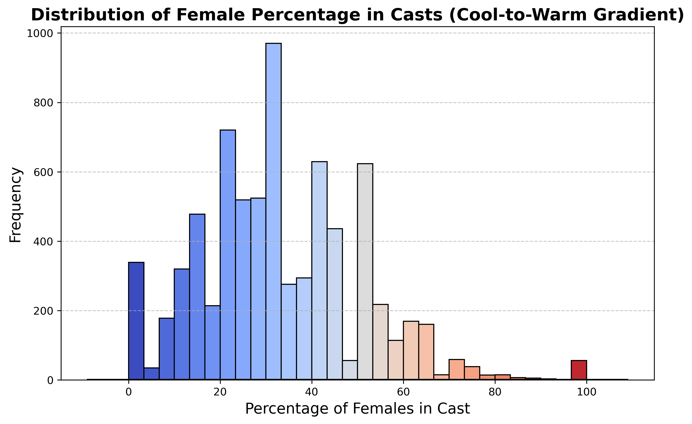
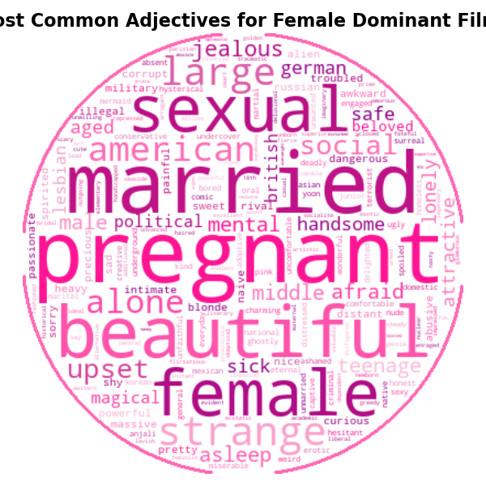
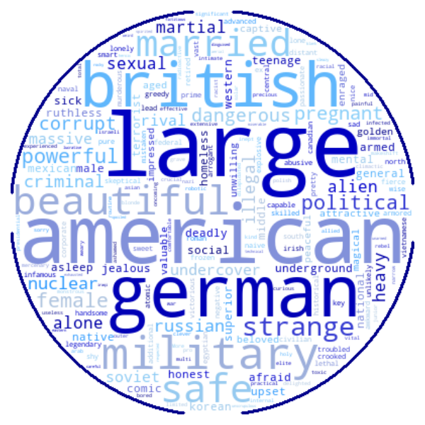
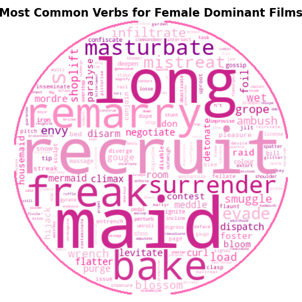
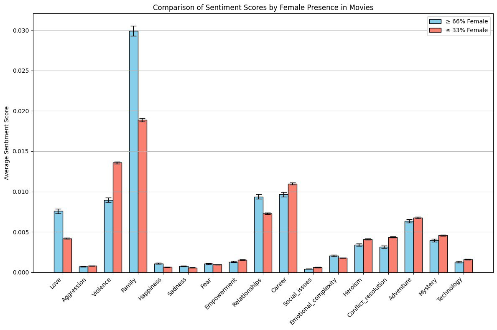
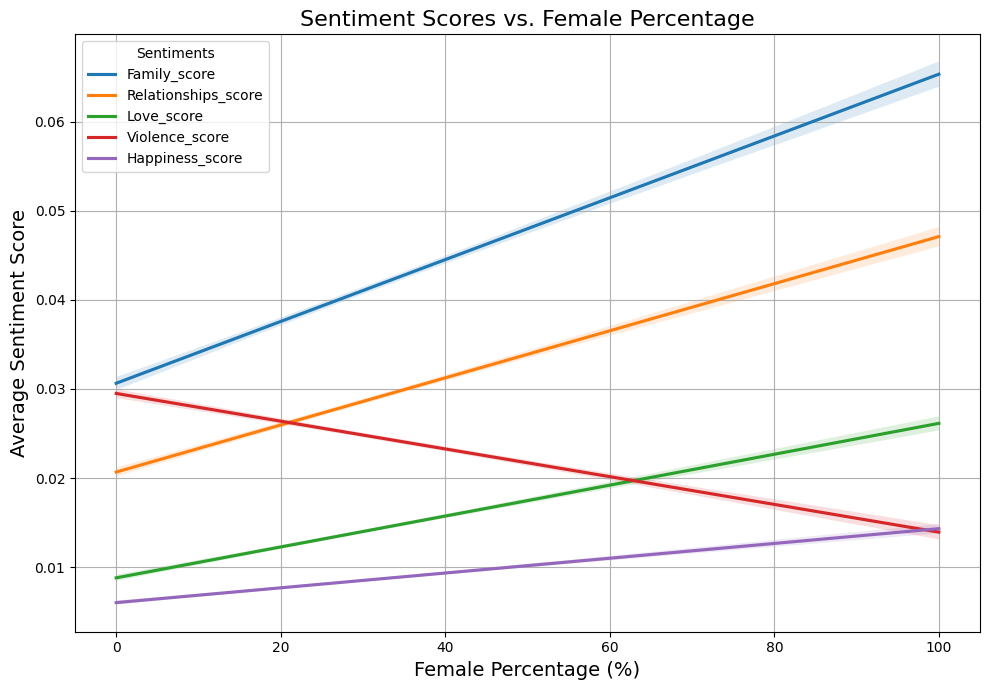

# Feminism, Representation, and Social Transformation in Film

Warning message. Angelina is a fictitious character created for the sake of the project.

### Introduction

(some AI generated photo?)
My name is Angelina, I am 21 years old and I just finished a school of theater in Paris. Theater has always been my passion, but the problem is the very low and unreliable salary. My dream now is to work in the movie industry where I will be able to continue acting, while earning a sufficient income.  
A friend of mine told me: “Movies are made by men for men. Women are just here to add sexyness”. 

It struck me, as I never could imagine such a strong statement could be true. In this era of fake news, I could not let my dreams be ruined by a few words so I decided to take the matter in my own hands. I decided to pursue a class at EPFL called ADA, and do my own analysis of all the movie industry. Then, and only then, I will be able to determine whether my friend was right or not.

### Starting from the beginning

I went on the internet and downloaded the information of all movies from wikipedia. At first glance I wanted to see the ratio of actresses and actors. I found out that there are 2 times more actors than actresses. I was a little disoriented. But since I am in Paris, I checked the same ratio, but in France which was around 1.71, slightly better than the average... I also took the opportunity to look at various countries, and whether they can beat France. Figure \[OSKAR...\] shows the ratio of actresses in each of the world regions. …

I was disappointed to see that women are much less present than men. But I did not lose hope, and figured that perhaps there was a great evolution of women in films. So I looked at the evolution of the percentage of women in films (<a href="#actress_num_movie">Figure 1</a>) globally but also by regions (figure…OSKAR)

    <figure id="actress_num_movie" style="margin-right: 20px; text-align: left;">
        <iframe src="figs/Mean_Ratio_and_Count_by_Movie_Release_Date.html" width="800" height="600" frameborder="0"></iframe>
        <figcaption style="text-align: center; margin-top: 4px;">
            Ratio of actresses and number of movies by year
        </figcaption>
    </figure>

The proportion of women in films increases very slightly from the 60s. In 1960 there were 31% actresses in films, while in 2011 there are 35%. In France, the ratio of actresses is constant, but slithly higher than the global average.

One thing I learned from ADA is that valuable information can be hidden in the data so I decided to dig further and look at the evolution of actresses in film by movie genre. <a href="#inclusive_genre">Figure 2</a> shows the list of genre with the highest and lowest gender ratio.

    <figure id="inclusive_genre" style="margin-right: 20px; text-align: center; flex: 1 1 auto;">
        <iframe src="figs/top_genres.html" width="800" height="600" frameborder="0"></iframe>
        <figcaption style="text-align: center; margin-top: 4px;">
            Most and least inclusive genres.
        </figcaption>
    </figure>

I find it amusing that the most "inclusive" genres (still bellow 50% of actresses in the cast) happens to be 'Kitchen sink realism'. The other genres are not much better: "Adult", or even "Melodrama". Obviously, women only complain and work in the kitchen :(. I will definitly need to see how women are represented in the film industry (will do later). On the other hand, the least inclusive genres are all those including violence or war. Woman are more tender that is true. It is sad because I loved "Spaghetti Western".

Definitely, my future does not look very bright from this perspective. But with my theater background, I am sure I will be able to get good acting roles, and be as famous as Scarlett Johansson. Actually I am wondering how top actresses are represented ? Do they have actual big roles, and play in many big movies ? How long are they ‘stars’ ? Do they continue to be celebrities once they are older ?

And so I went and explored my data. The problem was that I didn’t have a way to identify the main actors from my dataset. Nothing stops me, so I went online, found out that IMDB had a list of main roles, downloaded all the data, cleaned it, merged it, until I had a nice dataframe, one that would satisfy Maria and Bob.

I directly looked at the distribution of main roles. I found out that men have 72% of first roles. But actually I saw before that there are much more actors than actresses. So in that sense, it is logical that there are more first role for actors. However, proportionally, I see that men still have 56% of the first roles. That means if there was the same number of actors and actresses, actors would be more likely to get the first role. Crazy. Similarly to before, perhaps there is a bit of hope in the evolution. <a href="#ev_gender_ratio_roles">Figure 3</a> shows the evolution of the women having 1st, 2nd and 3rd roles. Nothing too glamorous as it remains quite constant. We can almost perceive a decrease in the share of women having first role :(. In 2012, there are only 26% of women with first role. That is not soo good for my carrer.

<figure id="ev_gender_ratio_roles">
    <iframe src="figs/percentage_evolution_of_actresses.html" width="800" height="500" frameborder="0"></iframe>
    <figcaption style="text-align: center; margin-top: 4px;">
        Evolution of the gender ratio for different roles 
    </figcaption>
</figure>

Let me investigate which genre is most welcoming for my career as an all time star. <a href="#genre_inslusive_firstrole">Figure 4</a> shows the most and least inclusive genre for first roles actors/actresses.

<figure id="genre_inslusive_firstrole">
    <iframe src="figs/first_role_genre.html" width="700" height="400" frameborder="0"></iframe>
    <figcaption style="text-align: center; margin-top: 4px;">
        Most and least inclusive genre for first role
    </figcaption>
</figure>

So either I am a feminist, or a pornstar. That's not very nice...

So clearly, women are not present in war films. But they are present in erotic movies 🙄

But then I thought : "perhaps the distribution is skewed due to the high number of 'small budget films'". "Perhaps the big films have more women actresses”. I didn’t really know why. I had this feeling. Perhaps it was just some hope.

So I kept only the films with the highest revenue (above …OSKAR), and looked at the distribution of roles actresses/actors. Figure …OSKAR shows the share of women with roles in these movies.

\[Discussion on graph\]

But if I become a star, how long will I remain a star? (Angelina dreaming) 
If I start to get older, will I remain famous and loved by all my fans? So I looked at the average age for the starting and ending career for both actors and actresses (<a href="#av_age_actors">figure 5</a>)

<figure id="av_age_actors">
    <iframe src="figs/average_age_of_actors.html" width="800" height="500" frameborder="0"></iframe>
    <figcaption style="text-align: center; margin-top: 4px;">
        Begining and ending career age for actors and actressses
    </figcaption>
</figure>

So basically, actresses start their career, on average, at 27 while men start at 32 years old. I think that means actresses are only good if they are still young and pretty. I can also see a disparity when the actors/actresses retire. Men finish their career much older than women and also stay longer (10 year for men while only 8 years for women). 

But then I thought, perhaps famous actresses play longer… Let me check. <a href="#first_age">Figure 6</a> shows the age distribution for first role actors/actresses. 

<figure id="first_age">
    <iframe src="figs/images/age_distribution_first_role.png" width="700" height="700" frameborder="0"></iframe>
    <figcaption style="text-align: center; margin-top: 4px;">
        Begining and ending career age for first role actors and actressses
    </figcaption>
</figure>
We see that first role actors play longer. Indeed, if we look at age 50, there are almost no actresses with first role, while men still have these roles. The most recurring age for first role actresses is 26 while it is 36 for men. That is not incredible for my career. I got to start soon. 

But then I thought that movies which generate high revenues might be more inclusive because they need reach out to more people. 

So my question now is whether big films have lots of actresses, and if there is a link between the two. So I went on and once more did the analysis, and as we see \[...LoLo\] Not so much… But then, clinging on for hope I decided to check whether, perhaps, having a woman in the first role would lead to higher revenue for a given film. Or would it be the opposite? \[Oskar graph 1\] But does this change across countries? Perhaps there are some countries where having an actress in first role is correlated with higher revenue? \[Oskar graph 1\] And what if I did become the biggest star of my country!? How much would I earn? Is the gender wage gap between the biggest stars of cinema different across countries? Let’s see \[Oskar graph 2\] Hmmm… But to be a star, I need to make sure the country I’m in actually produces movies. Let’s see which countries produce the most movies. We’ll only look at movies that list revenue to weed out very small films.

But is there any relation between the general gender ratio of a film and the revenue generated? \[...ALIX\] And is there a correlation between an actress's age and the revenue she generates? \[... ALIX\] How are women represented ? Okay, so the proportions of women in the movie industry could definitely be better… But now let’s see the types of roles I could have as an actress. How will people describe my roles? What type of actions will my characters perform? To find this out I need to have a way to differentiate female characters from men characters in movies. Let me look at the distribution of proportions of female characters in movies.

<figure id="sta">
    
    <figcaption style="text-align: center; margin-top: 4px;">
        Percentage of females in movie cast across all movies in CMU Dataset
    </figcaption>
</figure>

Well, it is highly skewed right, but that’s no real surprise anymore based on my previous analyses… However, this gives me an idea! I’ll split films by character gender ratio and look at the descriptive adjectives and verbs used in films with more men than women and vice versa through NLP methods. A ratio of 1:2 seems like a good cutoff point. I’ll also remove words that show up for both male dominant and female dominant films at similar frequencies.

    <figure id="fa" style="text-align: center;">
        
        <figcaption style="margin-top: 8px;">Most Common adjective lemmas for movies with more than two thirds female characters</figcaption>
    </figure>
    <figure id="ma" style="text-align: center;">
        
        <figcaption style="margin-top: 8px;">Most Common adjective lemmas for movies with more than two thirds male characters</figcaption>
    </figure>

    <figure id="fv" style="text-align: center;">
        
        <figcaption style="margin-top: 8px;">Most Common verb lemmas for movies with more than two thirds female characters</figcaption>
    </figure>
    <figure id="mv" style="text-align: center;">
        
        <figcaption style="margin-top: 8px;">Most Common verb lemmas for movies with more than two thirds male characters</figcaption>
    </figure>

Ah, well that’s not super encouraging either… It seems films with mostly women characters are characterized by love, marriage, pregnancy and sexuality… While movies with mostly men revolve around violence, power struggles, and crime. Ok let’s try a different approach to see the topics of movies with a large proportion of actresses. I’ll run sentiment analysis on a variety of topics for our movies with the same split on gender ratio

<figure id="sta">
    
    <figcaption style="text-align: center; margin-top: 4px;">
        Sentiment analysis across various topics between male and female dominant films
    </figcaption>
</figure>

\[START OF ALESSANDRO's PARAGRAPH\] Ok we see similar trends as the word cloud, but for the most part the variations are not as drastic as they could be. Running some hypothesis tests, all the variations are statistically significant. \[ALESSANDRO\]

# Exploring the Language of Film Through Gendered Lenses

## Introduction

I’ve spent quite some time looking at the proportion of actresses and actors in films, the roles they take, and how those numbers vary by time and place. I’ve seen that women are underrepresented, even though the situation has slightly improved over time. But raw numbers aren’t the whole story. If I really want to understand whether films reflect a masculine or feminine perspective, I need to look deeper. Are movies made “by men for men,” as my friend suggested, or do the stories themselves evolve when more women are involved?

To go further, I’ve decided to analyze the *language* used to summarize these films. Specifically, I want to know if movies with a higher proportion of actresses differ thematically from those dominated by actors. If they do, how do these themes vary over time and across regions? And are these differences actually statistically significant, or could they be due to chance?

## Preparing the Textual Data

To ensure I was comparing films on an even footing, I began with a thorough preprocessing of the movie summaries:

-   **Lowercasing:** All text was converted to lowercase.
-   **Lemmatization:** Words were reduced to their dictionary form (e.g., “running” → “run”).
-   **Filtering Common/Rare Terms:** Extremely common and extremely rare words were removed to focus on words that carry meaningful distinctions.

This cleaned corpus set the stage for identifying thematic categories.

## Defining and Identifying Thematic Categories

I created a set of **thematic categories**, each reflecting a concept like “love,” “violence,” “family,” “career,” “empowerment,” and more. Each category started as a seed list of words that define its core meaning. Using a language model, I embedded these seed words into a vector space and computed a “centroid” for each category—a sort of semantic average that represents the heart of that concept.

### Visualizing Category Word Clusters

To verify that my categories made sense, I looked at which words were most similar to each category’s centroid. I chose the top 100 words for each category, effectively broadening each theme beyond the initial seeds. To illustrate these clusters, I created a 3D visualization where each point represents a word, and words close together share similar meanings.

**Figure: 3D Visualization of Category Clusters**\

<figure id="fig6">
    <iframe src="figs/centroids_top_words_plot_3d.html" width="1000" height="500" frameborder="0"></iframe>
    <figcaption style="text-align: center; margin-top: 4px;">
        Evolution of the gender ratio for different roles 
    </figcaption>
</figure>

**Description:**\
In this plot, each cluster corresponds to one thematic category. For example, “love” words might cluster in one region, while “violence” words form a distinct cluster elsewhere. Tight clustering suggests that the categories are capturing coherent themes.

## Scoring Films by Thematic Content

For each category, I used the identified 100 words to score every movie. The score represents how many of these category-related words appear in the movie’s summary, normalized by total word count. This gave each film a “profile” across various themes—love, violence, family, etc.

## Relationship Between Gender Proportion and Category Intensity

Before splitting the data, it’s insightful to see if a higher female proportion directly correlates with an increase or decrease in certain category scores.

**Figure 4: Regression of Female Proportion vs. Category Score**
<figure id="fig7">
    
    <figcaption style="text-align: center; margin-top: 4px;">
        Evolution of the gender ratio for different roles
    </figcaption>
</figure>

**Description: The figure shows the top 5 sentiments score as a function of female percentage**\
In this scatter plot, each film is represented by a point. The x-axis is the proportion of female roles, and the y-axis is a category’s score (e.g., “relationships”). The regression line shows whether more women correlate with higher “relationships” themes.

## Splitting the Dataset by Gender Dominance

From the previous graph we could already see that the scores can change depending on the percentage of female actress in the movies. Let's now try to split the dataset to see if we can see this difference also for other sentiments:

Since my focus is on gender representation and perspective, I split the dataset into two groups:

-   **Female-Dominant Films:** Movies with a higher proportion of actresses.
-   **Male-Dominant Films:** Movies with a higher proportion of actors.

Comparing category scores across these two subsets could reveal whether different gender balances correlate with shifts in narrative themes.

## Comparing Thematic Scores Between Female- and Male-Dominant Films

I aggregated the category scores for both subsets and visualized them side-by-side.

**Figure 2: Average Category Scores by Gender Dominance**

<figure id="fig2">
    <iframe src="figs/interactive_sentiment_comparison.html" width="1000" height="600" frameborder="0"></iframe>
    <figcaption style="text-align: center; margin-top: 4px;">
        Average category scores by gender dominance
    </figcaption>
</figure>

**Description:**  
This figure shows, for each thematic category, the average score among female-dominant and male-dominant films. Bars are accompanied by error bars indicating the 95% confidence interval.

**Statistical Note:**

It's clear how especially for some categories the difference between male- and female-dominant movies is drastic, but it's better to be sure.\
I conducted Mann-Whitney U tests for each category to assess whether the differences in medians are significant. Several categories—such as those related to “family,” “love,” or “relationships”—show significantly higher scores in female-dominant films (p \< 0.05), while categories related to “violence” or “aggression” are higher in male-dominant ones (p \< 0.01). These results reinforce the notion that more women on screen might correlate with more relational, less confrontational narratives.

| Category | Female Mean | Male Mean | p-value | Significant? | Higher in |
|------------|------------|------------|------------|------------|------------|
| Love | 0.02 | 0.01 | 0.000 | Yes | Female Majority |
| Aggression | 0.01 | 0.01 | 0.000 | Yes | Male Majority |
| Violence | 0.02 | 0.03 | 0.000 | Yes | Male Majority |
| Family | 0.06 | 0.03 | 0.000 | Yes | Female Majority |
| Happiness | 0.01 | 0.01 | 0.000 | Yes | Female Majority |
| Sadness | 0.01 | 0.00 | 0.000 | Yes | Female Majority |
| Fear | 0.01 | 0.00 | 0.001 | Yes | Female Majority |
| Empowerment | 0.01 | 0.01 | 0.000 | Yes | Male Majority |
| Relationships | 0.04 | 0.02 | 0.000 | Yes | Female Majority |
| Career | 0.02 | 0.02 | 0.000 | Yes | Male Majority |
| Social_issues | 0.01 | 0.01 | 0.000 | Yes | Male Majority |
| Emotional_complexity | 0.01 | 0.01 | 0.001 | Yes | Female Majority |
| Heroism | 0.01 | 0.01 | 0.000 | Yes | Male Majority |
| Conflict_resolution | 0.01 | 0.02 | 0.000 | Yes | Male Majority |
| Adventure | 0.01 | 0.01 | 0.000 | Yes | Female Majority |
| Mystery | 0.01 | 0.02 | 0.000 | Yes | Male Majority |
| Technology | 0.01 | 0.01 | 0.000 | Yes | Female Majority |

## Temporal Dynamics of Thematic Differences

It’s also essential to consider how these differences evolve over time. Perhaps early in cinema history, all films were similar, but patterns emerged later.

**Figure 3: Temporal Trends in Category Scores by Gender Dominance**  
<figure id="fig2">
    <iframe src="figs/sentiments_time.html" width="1000" height="600" frameborder="0"></iframe>
    <figcaption style="text-align: center; margin-top: 4px;">
        Average category scores by gender dominance
    </figcaption>
</figure>

**Description:**  
This figure shows how the scores for select categories changed over decades for both female- and male-dominant films. For instance, “empowerment” themes might have grown slightly in female-dominant films since the 1960s, while “violence” themes have remained consistently high in male-dominant films.

## Geographic Variations

To understand if cultural context matters, I mapped category differences worldwide. Do certain regions lean towards more traditionally “feminine” narratives when more women are involved?

**Figure 6: Geographic Distribution of Category Differences**  
<figure id="fig2">
    <iframe src="figs/geographic_sentiment_score.html" width="1000" height="600" frameborder="0"></iframe>
    <figcaption style="text-align: center; margin-top: 4px;">
        Average category scores by gender dominance
    </figcaption>
</figure>

**Description:**\
A world map visualization shows each country colored or marked depending on which subset (female- or male-dominant) scores higher in a chosen category. Patterns might emerge, such as European countries showing a stronger “happiness” or “empowerment” theme when more women are present, while other regions remain more neutral.

## Observations

Working through this textual analysis, I’ve seen that the presence of more women in a film often correlates with noticeable thematic differences. These differences aren’t always huge, and they don’t entirely break free from long-standing stereotypes, but they are real and statistically verifiable.

In essence, while the industry still shows signs of having been “made by men for men,” there are subtle shifts. The words used to summarize films reflect more relational, emotional, and sometimes even empowering narratives as women’s representation increases. Over time and across borders, these patterns evolve. This gives me hope that the film industry’s stories can—and do—change as more women step into the spotlight.

I’ll carry these insights forward as I continue to explore the industry and shape my own journey within it.

\[END OF ALESSANDRO's PARAGRAPH (for now)\]

[START OF YASSINE's PARAGRAPH]
# Giving a voice to women: looking at directors

I’ve focused all my energy on researching actors so far, but what if I looked at directors instead? What if I ever want to direct a movie? What are my chances?  
I’ll first look at general gender ratio across directors.

<figure>
    <iframe src="figs/directors_html/director_gender_distribution_and_proportions" width="1000" height="700" frameborder="0"></iframe>
    <figcaption style="text-align: center; margin-top: 4px;">Director / Gender distribution</figcaption>
</figure>

And what about the number of movies per director? Does that change across genders?  

<figure>
    <iframe src="figs/directors_html/average_movie_count_per_director.html" width="1000" height="600" frameborder="0"></iframe>
    <figcaption style="text-align: center; margin-top: 4px;">Average movie count per gender</figcaption>
</figure>

Ouch… Ok, I see that there is only 10 % of women directors in the dataset. Maybe in previous years the industry was more male dominated? How has this proportion evolved over the years?  

<figure>
    <iframe src="figs/directors_html/director_gender_by_year_bins.html" width="1000" height="600" frameborder="0"></iframe>
    <figcaption style="text-align: center; margin-top: 4px;">Director Gender Representation by Year</figcaption>
</figure>

Looks like it increased a little bit compared to the 70s, but we are still a minority! Maybe I should consider geographical location as well. Are there some countries with higher proportions of female directors? Should I really move countries?

<figure>
    <iframe src="figs/directors_html/director_countries.html" width="1000" height="600" frameborder="0"></iframe>
    <figcaption style="text-align: center; margin-top: 4px;">Director Gender Representation by Country</figcaption>
</figure>

I guess I will not move. But which genre has the most women directors? Should I try to specialize in one particular genre?

<figure>
    <iframe src="figs/directors_html/director_gender_by_genre.html" width="1000" height="600" frameborder="0"></iframe>
    <figcaption style="text-align: center; margin-top: 4px;">Director Gender Representation by Genre</figcaption>
</figure>

Well, I am still not ready to revolutionize the movie industry as a director. But I would like to work on it, and learn from a mentor that would encourage me and propel me into changing the cinema field. My dream now is to land a main role in a movie. Would I have more chances to land the role if the director is a woman?  
And what about the casting choices of Directors? Do female directors hire more females than male directors? What about taking a first, second, or third role? Do we have a bias?

<figure>
    <iframe src="figs/directors_html/director_gender_roles_with_precise_ratios.html" width="1000" height="600" frameborder="0"></iframe>
    <figcaption style="text-align: center; margin-top: 4px;">Male Female Representation in Main Roles (Top 3) by Director Gender</figcaption>
</figure>

<figure>
    <iframe src="figs/directors_html/director_role_distribution_with_ratios.html" width="900" height="600" frameborder="0"></iframe>
    <figcaption style="text-align: center; margin-top: 4px;">Male Female Representation by Director Gender for First, Second, and Third Role</figcaption>
</figure>

Looking at other societal issues : what’s been done ?
